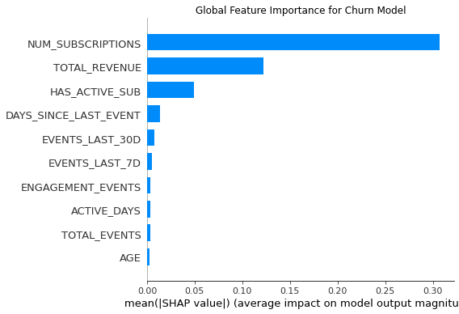
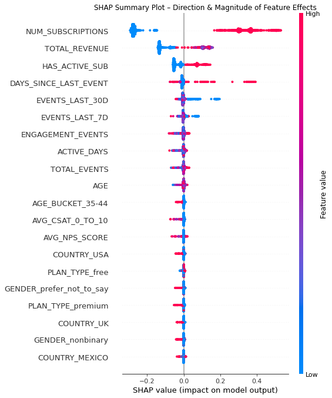

# 📊 SaaS Customer Churn Analytics & Experiment Evaluation
## End-to-End Data Science Project: Data Engineering → Analytics → Modeling → BI Dashboards

### 🔗 Interactive Dashboards (Tableau Public)

View the full interactive dashboard collection [here](https://public.tableau.com/views/SaaSCustomerChurnAnalyticsABTesting/SaaSCustomerChurnAnalyticsExperimentEvaluation?:language=en-US&publish=yes&:sid=&:redirect=auth&:display_count=n&:origin=viz_share_link).

---
### 📌 Project Overview

This project simulates a complete analytics workflow for a SaaS company using synthetic but realistic data. It covers every stage of the data science lifecycle—from data generation and warehousing, through SQL feature engineering, to predictive modeling and interactive dashboards.

Primary objectives:

- Identify the key drivers of customer churn
- Build predictive churn models
- Evaluate an A/B experiment
- Create executive-ready dashboards
- Demonstrate end-to-end analytic and engineering capability

### 🛠️ Tech Stack
Layer	Tools
- Programming	Python: (pandas, sklearn, shap, matplotlib, seaborn)
- Data Engineering: Snowflake Data Warehouse, SQL
- Visualization / BI:	Tableau Public
- Modeling:	Logistic Regression, Random Forest, SHAP Explainability
- Architecture:	Multi-layer warehouse: RAW → TRANSFORM → ANALYTICS → FTR_CHURN

### 🏗️ Data Architecture
RAW  →  TRANSFORM  →  ANALYTICS (Star Schema)  →  FTR_CHURN (Modeling)

#### Raw Layer (CSV Ingestion)

- USERS_RAW
- SUBSCRIPTIONS_RAW
- EVENTS_RAW
- SURVEY_RESPONSES_RAW
- EXPERIMENT_ASSIGNMENTS_RAW

#### Transform Layer (Clean & Standardize)

- STG_USERS
- STG_SUBSCRIPTIONS
- STG_EVENTS
- STG_SURVEYS
- STG_EXPERIMENT_ASSIGNMENTS

#### Analytics Layer (Star Schema)

- DIM_USERS
- FACT_EVENTS
- FACT_SUBSCRIPTIONS
- FACT_SURVEYS
- FACT_EXPERIMENT_ASSIGNMENTS
- USER_CHURN_LABEL
- USER_EVENTS_AGG
- USER_EXPERIMENT_AGG
- USER_SUBSCRIPTION_AGG
- USER_SURVEY_AGG

#### Final Modeling Table

FTR_CHURN — unified feature table for machine learning

### 🔍 Exploratory & Behavioral Insights

Key churn-related observations:

- Users with multiple subscription renewals churn far less frequently
- Higher lifetime revenue strongly correlates with retention
- Days Since Last Event is a powerful churn signal (sharp rise after ~40 days inactive)
- Active subscription status dramatically reduces churn risk
- Satisfaction metrics (NPS/CSAT) have directional but weaker influence

### 🤖 Predictive Modeling

Two models were developed:

#### 1. Logistic Regression

- Interpretable baseline
- Shows directional effects of features

#### 2. Random Forest Classifier

- Captures nonlinear patterns
- Enabled feature importance extraction
- Achieved ≈98% AUC

#### Top Predictors of Churn

1. Number of Subscriptions
2. Total Revenue
3. Has Active Subscription
4. Days Since Last Event

### 📈 Model Explainability (SHAP)

SHAP was used to explain model decisions globally and for individual users.

#### Global Feature Importance (SHAP Bar Plot)




SHAP Beeswarm Plot (Feature Influence & Distribution)




**Interpretation:**

- Red = higher values, Blue = lower values
- High subscription count and long inactivity push predictions toward churn
- Active subscription status strongly reduces churn probability

#### SHAP Dependence Plot (Days Since Last Event × Subscriptions)


**Insight:**

Churn risk spikes sharply after ~40 days of inactivity, and the effect is amplified for users with multiple past subscriptions.

### 🧪 Experiment (A/B Test) Evaluation

A randomized experiment evaluated a hypothetical engagement treatment.

**Outcome Summary**

- No significant difference in churn between control and treatment
- Engagement lift was minimal
- Revenue and satisfaction changes were not meaningful

📌 Conclusion: Treatment not effective → requires redesign.

### 📊 Dashboards (Tableau Public)

The Tableau workbook contains six dashboards:

- Project Overview Page
- Customer Churn Overview
- Churn Drivers & Behavioral Insights
- Satisfaction & Segment Insights
- A/B Experiment Summary
- Recommendations Page

### 📝 Key Findings

- Churn is primarily driven by subscription lifecycle maturity and customer value, not short-term sentiment.
- Engagement recency is still actionable, especially around the 40-day inactivity threshold.
- Predictive modeling validated analytical insights with high fidelity.
- The A/B experiment showed no measurable improvement, indicating the need for stronger interventions.

### 🚀 Next Steps

Planned enhancements include:

- Subscription renewal probability modeling (survival analysis, GBMs)
- Automated churn scoring pipelines (dbt / Airflow / Snowflake Tasks)
- Customer lifetime value (LTV) modeling
- Real-time dashboards for customer success teams
- Behavioral segmentation using clustering techniques (k-means, GMM)

### 📁 Repository Structure
```
.
├── data/
│   ├── raw/
|   |   ├── users.csv
|   |   ├── survey_responses.csv
|   |   ├── subscriptions.csv
|   |   ├── events.zip (CSV was too large)
|   |   └── experiment_assignments.csv
│   ├── final/
|   |   └── FTR Churn Export.csv
├── python/
│   └── Generating Datasets.py
│   ├── model/
|   |   └── Snowflake Load, Machine Learning Models, and SHAP Analysis.py
│   ├── plots/
|   |   ├── Feature Importance Plot (Random Forest).png
|   |   ├── SHAP Bar Summary Plot.png
|   |   ├── SHAP Dependence Plot.png
|   |   └── SHAP Summary Plot.png
├── sql/
│   └── Warehouse, Schema, and Table Generation.sql
│   ├── transform/
|   |   ├── STG_EVENTS Generation.sql
|   |   ├── STG_USERS Gernation.sql
|   |   ├── STG_SURVEYS Generation.sql
|   |   ├── STG_SUBSCRIPTIONS Generation.sql
|   |   └── STG_EXPERIMENT_ASSIGNMENTS Generation.sql
│   ├── analytics/
|   |   ├── DIM_USERS Generation.sql
|   |   ├── FACT_EVENTS Gernation.sql
|   |   ├── FACT_SURVEY_RESPONSES Generation.sql
|   |   ├── FACT_SUBSCRIPTIONS_CLEAN Generation.sql
|   |   ├── FACT_EXPERIMENT_ASSIGNMENTS Generation.sql
|   |   ├── USER_CHURN_LABEL Generation.sql
|   |   ├── USER_EVENTS_AGG Gernation.sql
|   |   ├── USER_EXPERIMENT_AGG Generation.sql
|   |   ├── USER_SUBSCRIPTION_AGG Generation.sql
|   |   ├── USER_SURVEY_AGG Generation.sql
|   |   ├── FTR_CHURN Generation.sql
|   |   └── Sanity Checks.sql
├── dashboards/
│   ├── Introductory Overview Page.png
│   ├── Customer Churn Overview.png
│   ├── Churn Drivers & Behavioral Insights.png
│   ├── Satisfaction & Segment Insights.png
│   ├── Experiment Summary.png
│   └── Conclusions and Recommendations.png
├── documentation/
│   ├── architecture_diagram.md
│   ├── data_dictionary.csv
│   └── methodology.md
└── README.md
```
### 📬 Contact

Victoria De Los Santos
🔗 [LinkedIn](www.linkedin.com/in/victoriadls)
